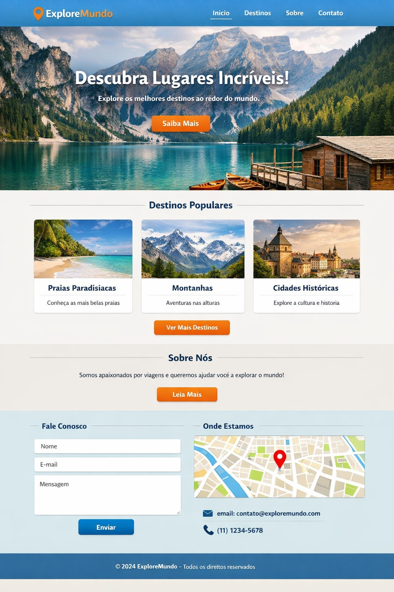

# Progweb-202601-atividade04

## Link para acessar resultado final no Pages: https://filipe08-000.github.io/Progweb-202601-atividade04/

# ExploreMundo - Agência de Viagens

Projeto desenvolvido para a disciplina de **Programação Web (2026/01)**. Este site é uma landing page responsiva para uma agência de viagens, focada em destinos turísticos ao redor do mundo.

## Sobre o Projeto

O objetivo desta atividade foi replicar um layout de alta fidelidade utilizando tecnologias web fundamentais, mantendo a identidade visual e a organização do código, seguindo uma única imagem de referência e para refazê-la idêntica. 

### Funcionalidades:
* **Página Inicial:** Banner principal, seção de destinos populares, seção "Sobre Nós" e formulário de contato com mapa.
* **Página de Destinos:** Uma página secundária que expande o catálogo de viagens mantendo a mesma identidade visual.
* **Design Responsivo:** Adaptado para diferentes resoluções.

## Tecnologias Utilizadas

Para este projeto, foram utilizadas exclusivamente tecnologias nativas, sem o uso de frameworks externos:

* **HTML5:** Estruturação semântica do conteúdo.
* **CSS3:** Estilização, layouts com Flexbox e gradientes.
* **FontAwesome:** Ícones para a interface.
* **Google Fonts:** Tipografia personalizada.

## Demonstração

O layout conta com:
1.  **Header:** Navegação rápida e logomarca.
2.  **Cards:** Exibição de destinos com imagens e descrições.
3.  **Formulário:** Área de captura de leads e contatos.
4.  **Footer:** Informações de copyright e direitos.

## Imagem usada para realização da atividade
Foi preciso recriar está imagem exatamente igual só que como site, e ainda adicionar uma página no mesmo estilo para ver mais destinos sem referência apenas seguindo o layout da primeira.


---

## 📂 Como rodar o projeto localmente

1. Clone o repositório:
   ```bash
   git clone [https://github.com/Filipe08-000/Progweb-202601-atividade04.git](https://github.com/Filipe08-000/Progweb-202601-atividade04.git)
